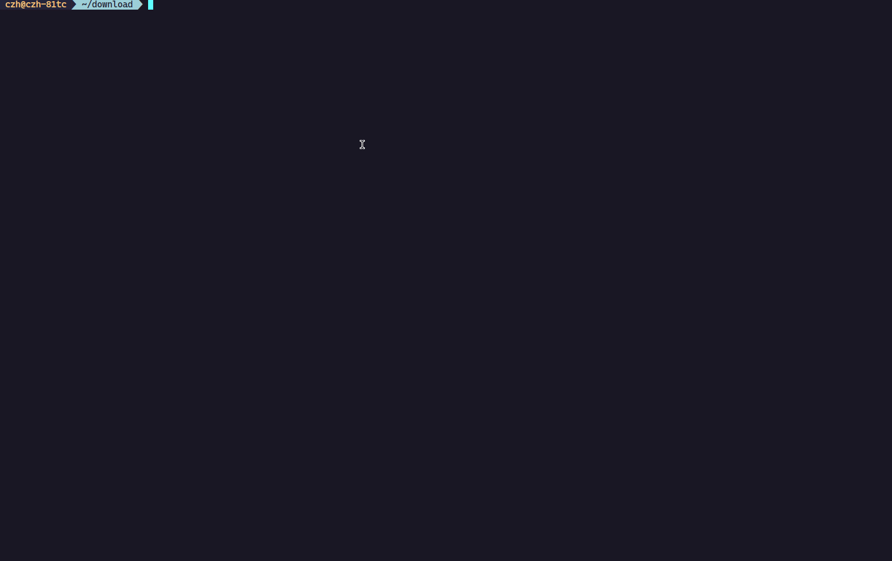
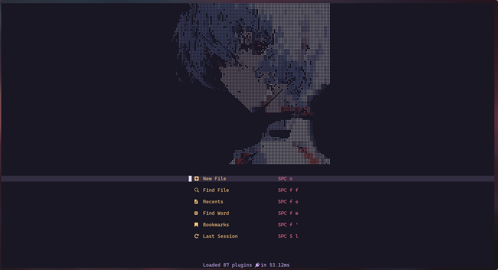
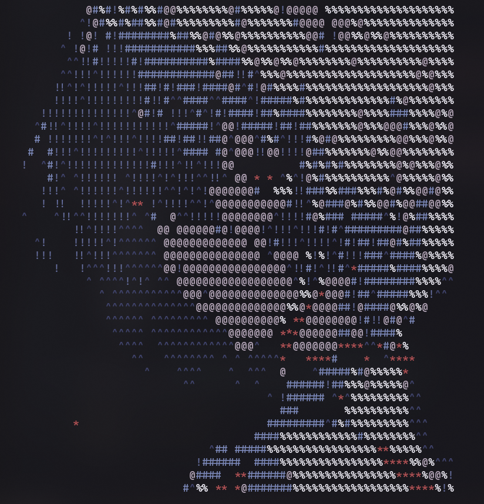

Convert image/gif/video to ascii art. If you inputs have plenty of frames, you can specify `--fast` to use torch accelerating the peocess.

## Screen Shot




## Experimental feature

Now you can add `--alpha` to generate neovim highlight definitions, for example:

```sh
img2art xxx.png --scale 0.1 --threshold 120 --save-raw ./xxx.lua --alpha
```

It will generate code definitions in target file which consists of two parts:

1. Code of setting neovim highlight like `vim.api.nvim_set_hl(0, "I2A0", { fg="#2f3651" })`, which will be plenty of lines.
2. The difinition of alpha header, which consists of the mapping between every pixels and highlights and the ascii art warppered by `[[  ]]` every single line.

Require the generated lua file and set properly in your config of alpha-nvim (assign header to `dashboard.section.header`), it will be:



If img2art generate too much lines, you can specify `--quant n` to reduce the color level of input image. n is a positive integer which should be smaller than 256.

```sh
img2art xxx.png --scale 0.1 --threshold 120 --save-raw ./xxx.lua --alpha --quant 16
```

## Installation

requirements: typer[all], opencv-python, numpy

```
pip install img2art
```

## Usage

```
img2art --help
```

result:

```
 Usage: img2art [OPTIONS] SOURCE

╭─ Arguments ──────────────────────────────────────────────────────────────────────────────────────────────╮
│ *    source      TEXT  Path to image [default: None] [required]                                          │
╰──────────────────────────────────────────────────────────────────────────────────────────────────────────╯
╭─ Options ────────────────────────────────────────────────────────────────────────────────────────────────╮
│ --with-color    --no-with-color                                  Whether use color. If you specify       │
│                                                                  alpha, with-color will be forcely set   │
│                                                                  to True.                                │
│                                                                  [default: no-with-color]                │
│ --scale                            FLOAT                         Scale applied to image [default: 1.0]   │
│ --threshold                        INTEGER                       Threshold applied to image, default to  │
│                                                                  OSTU                                    │
│                                                                  [default: -1]                           │
│ --save-raw                         TEXT                          Whether to save the raw data            │
│                                                                  [default: None]                         │
│ --bg-color                         <INTEGER INTEGER INTEGER>...  Backgound color, (-1, -1, -1) for none  │
│                                                                  [default: -1, -1, -1]                   │
│ --fast          --no-fast                                        Whether use torch to accelerate when    │
│                                                                  you inputs have plenty of frames.       │
│                                                                  [default: no-fast]                      │
│ --chunk-size                       INTEGER                       Chunk size of Videos or Gifs when using │
│                                                                  torch.                                  │
│                                                                  [default: 1024]                         │
│ --alpha         --no-alpha                                       Whether generating lua code for         │
│                                                                  alpha-nvim.                             │
│                                                                  [default: no-alpha]                     │
│ --quant                            INTEGER                       Apply color quantization. [default: -1] │
│ --mapping                          TEXT                          User-define ascii characters, need to   │
│                                                                  be from light to dark. The quant will   │
│                                                                  be forcely set to length of mapping.    │
│ --loop          --no-loop                                        Loop the output when input is GIF or    │
│                                                                  Video, use Ctrl-C to end this.          │
│                                                                  [default: no-loop]                      │
│ --interval                         FLOAT                         Interval when playing GIF or Video      │
│                                                                  output.                                 │
│                                                                  [default: 0.05]                         │
│ --help                                                           Show this message and exit.             │
╰──────────────────────────────────────────────────────────────────────────────────────────────────────────╯
```

```
img2art path/to/image --scale 0.5 --with-color --threshold 127 --bg-color 255, 255, 255 --save-raw path/to/save.txt --alpha --quant 16
```

Use your own characters mappings:

```
img2art path/to/image --scale 0.1 --with-color --threshold 127 --bg-color 255, 255, 255 --save-raw path/to/save.txt --alpha --mapping " ^*!#@%"
```

For output of gif or video, you can write a shell script to play it or use some tools like [rustyAscii](https://github.com/Arch-Storm/rustyAscii).



## Reference

[bobibo](https://github.com/orzation/bobibo)
